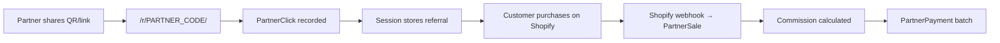

# Evolvée Radiance — QR Partner Program

A Django-based affiliate / ambassador / referral system for **Evolvée Radiance**. Partners sign up, receive a unique QR code and discount code, share with their audience, and track scans, conversions, revenue, and commissions from a mobile-friendly dashboard. Staff use a separate **Command Center** to monitor program performance, partner regions, and per-influencer analytics.

## Features (MVP)

- **Partner onboarding** — moderated application with pending → approved workflow
- **Unique partner codes** — auto-generated codes like `ER-A1B2C3`
- **QR code generation** — created automatically when a partner is approved
- **Click tracking** — `/r/<partner_code>/` logs scans and sets a 30-day referral session
- **Regional analytics** — scan locations (city, state/region, country) from IP geolocation
- **Sales & commissions** — per-order tracking with configurable commission %
- **Payout records** — pending / paid payment reconciliation by period
- **Marketing asset hub** — upload social copy, images, and campaign materials
- **Partner dashboard** — mobile-optimized stats, earnings, QR sharing, recent sales
- **Admin Command Center** — program KPIs, partner leaderboard, region breakdown, per-partner drill-down
- **REST API** — for mobile app or Shopify integration
- **Shopify webhooks** — automatic order tracking, refunds, and cancellations
- **Django admin** — approve partners, manage sales, and process payouts

## Project structure

```
evolvee-partners/
├── config/           # Django settings & URLs
├── partners/         # Core app (models, views, API, admin)
├── templates/        # Partner-facing HTML
├── static/           # CSS
└── media/            # QR codes & marketing assets (created at runtime)
```

## Database models

| Model | Purpose |
|-------|---------|
| `Partner` | Profile, location, commission %, QR code, totals |
| `PartnerSale` | Individual orders & commission amounts |
| `PartnerClick` | QR scan / link click analytics with geo fields |
| `PartnerPayment` | Payout batches linked to sales |
| `MarketingAsset` | Pre-made content for partners |
| `ProgramActivity` | Central event log for admin analytics |
| `ShopifyWebhookEvent` | Webhook audit log and idempotency |

## Quick start

### 1. Set up the project

```powershell
cd "Evolvee Radiance Internship\evolvee-partners"

py -m venv venv
.\venv\Scripts\Activate.ps1

pip install -r requirements.txt

copy .env.example .env
py manage.py migrate
py manage.py runserver
```

When you run `runserver`, the terminal asks whether you are a new admin:

- **1** — runs `createsuperuser` so you can create an account now
- **2** — prints the admin login URL for an existing account

Skip the prompt in CI or scripts with `py manage.py runserver --skip-startup-prompt`.

### 2. Open the app

| URL | Description |
|-----|-------------|
| http://127.0.0.1:8000/apply/ | Partner application |
| http://127.0.0.1:8000/login/ | Partner login |
| http://127.0.0.1:8000/admin/login/ | **Staff / admin login** → Command Center |
| http://127.0.0.1:8000/command-center/ | Admin dashboard (staff only) |
| http://127.0.0.1:8000/ | Partner dashboard |
| http://127.0.0.1:8000/profile/ | Partner profile, payment details, messages |
| http://127.0.0.1:8000/admin/ | Django admin panel |
| http://127.0.0.1:8000/r/ER-XXXXXX/ | Tracked referral redirect |

### 3. Admin vs partner access

| Role | Login URL | Lands on |
|------|-----------|----------|
| **Staff / superuser** | `/admin/login/` | Command Center (`/command-center/`) |
| **Partner / influencer** | `/login/` | Partner dashboard (`/`) |

The pink partner nav includes an **Admin** button (when logged out) that links to `/admin/login/`.

### 4. Approve, decline, or suspend a partner

In Django admin (`/admin/partners/partner/`):

1. Select one or more partners and use **Approve**, **Decline**, or **Suspend**
2. Optionally add a message — it is emailed to the creator and shown in their portal profile
3. When editing a single partner, change **Status** and optionally fill in **Message to partner** before saving

Creators receive status updates by **email** (console in dev) and **in-app messages** on their dashboard and profile.

### 5. Partner profile & payouts

After approval, partners open **My profile** from the navbar (avatar / name):

- View personal details (name, email, social handle)
- Add or update **payment method** and payout details — synced automatically to Django admin for staff payouts

Social media handle is **required** at signup. Payout details are collected **after approval** in the profile, not during application.

### 6. Excel exports (Django admin)

| Location | Export |
|----------|--------|
| **Partners** changelist | **Export all to Excel** (top right) or select rows → **Export selected partners to Excel** |
| **Program activities** | Select rows → **Export selected activity to Excel** |
| **Command Center** | **Export Creators (Excel)** — full roster with stats, payment info, and QR images |

## Command Center (admin)

Staff-only analytics at `/command-center/`:

- Program KPIs — partners, scans, conversions, revenue, commissions
- **Top scan regions** — e.g. Los Angeles, California, US
- **Scans by country**
- **Partner leaderboard** — click any partner for a full drill-down
- Activity feed and CSV export

Per-partner detail pages show performance charts, audience regions, recent scans/sales, and activity logs.

**Excel export:** In Command Center, click **Export Creators (Excel)** to download a printable roster with creator names, IDs, location (city, state, country, continent), sales stats, referral links, and embedded QR code images.

Regional data is captured automatically on each QR scan (via IP geolocation). Partners can also enter their city/region/country during application; continent is inferred from country when possible.

Optional offline geolocation: set `GEOLITE2_CITY_PATH` in `.env` to a [MaxMind GeoLite2-City](https://dev.maxmind.com/geoip/geolite2-free-geolocation-data) database file.

## API endpoints

| Method | Endpoint | Auth | Description |
|--------|----------|------|-------------|
| POST | `/api/apply/` | Public | Submit partner application |
| GET | `/api/me/` | Partner | Profile & codes |
| GET | `/api/stats/` | Approved | Performance stats |
| GET | `/api/sales/` | Approved | Sales history |
| GET | `/api/payments/` | Approved | Payout history |
| GET | `/api/assets/` | Approved | Marketing assets |

### Shopify webhooks

| Topic | Endpoint | Description |
|-------|----------|-------------|
| `orders/paid` | `/webhooks/shopify/orders/paid/` | Record sale & commission |
| `orders/cancelled` | `/webhooks/shopify/orders/cancelled/` | Cancel attributed sale |
| `refunds/create` | `/webhooks/shopify/refunds/create/` | Handle refunds |

## Shopify integration

Orders are attributed to partners automatically when Shopify sends webhooks to your Django app.

### How attribution works

A partner is matched from a Shopify order using the first match found:

1. **Discount code** — matches partner code (e.g. `ER-A1B2C3`)
2. **Cart note attributes** — `ref` or `partner_code` set by the theme script
3. **Landing site ref** — `?ref=` in the URL the customer arrived from
4. **Order tags** — tags starting with `ER-`

### 1. Configure environment

Add to `.env`:

```env
SHOPIFY_WEBHOOK_SECRET=your-signing-secret
SHOPIFY_SHOP_DOMAIN=evolvee-radiance.myshopify.com
SHOPIFY_ACCESS_TOKEN=shpat_...
SHOPIFY_WEBHOOK_BASE_URL=https://partners.evolveeradiance.com
```

`SHOPIFY_WEBHOOK_SECRET` is shown when you create a custom app or webhook in Shopify Admin.

### 2. Add referral tracking to your Shopify theme

Upload `static/shopify/partner-attribution.js` to your theme assets, then add before `</body>` in `theme.liquid`:

```liquid
<script src="{{ 'partner-attribution.js' | asset_url }}" defer></script>
```

This captures `?ref=ER-XXXXXX` from the URL and stores it as a cart attribute so it appears on the order.

### 3. Create matching discount codes in Shopify

For each approved partner, create a Shopify discount code matching their partner code (e.g. `ER-A1B2C3`). This gives partners a shareable code **and** a reliable attribution signal.

### 4. Register webhooks

Your app must be publicly reachable (use [ngrok](https://ngrok.com/) for local testing):

```powershell
python manage.py register_shopify_webhooks --base-url https://your-public-domain.com
```

Registered endpoints:

| Webhook | Endpoint | Action |
|---------|----------|--------|
| `orders/paid` | `/webhooks/shopify/orders/paid/` | Creates sale, calculates commission |
| `orders/cancelled` | `/webhooks/shopify/orders/cancelled/` | Marks sale cancelled |
| `refunds/create` | `/webhooks/shopify/refunds/create/` | Handles full/partial refunds |

List existing webhooks:

```powershell
python manage.py register_shopify_webhooks --list
```

### 5. Verify in admin

Open **Shopify webhook events** in Django admin to inspect processed, skipped, and failed webhooks.

### Local testing with ngrok

```powershell
ngrok http 8000
# Set SHOPIFY_WEBHOOK_BASE_URL to the ngrok HTTPS URL
python manage.py register_shopify_webhooks
```

## Referral flow



## Future enhancements (planned)

- Tiered reward levels
- Performance insights (best days/times)
- Social sharing integration
- Gamification (leaderboards, milestones)
- Printable QR materials
- Partner community space

## Configuration

Key settings in `.env`:

- `PARTNER_REFERRAL_BASE_URL` — your store URL with `?ref=` suffix
- `DEFAULT_COMMISSION_PERCENTAGE` — default commission for new partners
- `PAYMENT_SCHEDULE` — `monthly` or `bi-weekly` (display only for now)
- `GEOLITE2_CITY_PATH` — optional path to GeoLite2-City.mmdb for offline IP geolocation
- `MAIN_WEBSITE_URL` — logout redirect target (falls back to `/apply/` while the placeholder value is set)
- `SHOPIFY_WEBHOOK_SECRET` — HMAC signing secret from Shopify
- `SHOPIFY_SHOP_DOMAIN` — your `*.myshopify.com` domain
- `SHOPIFY_ACCESS_TOKEN` — Admin API token for registering webhooks
- `SHOPIFY_WEBHOOK_BASE_URL` — public URL where Shopify sends webhooks

## Tech stack

- Django 5
- Django REST Framework
- SQLite (dev) / PostgreSQL (production)
- Pillow + qrcode for QR generation
